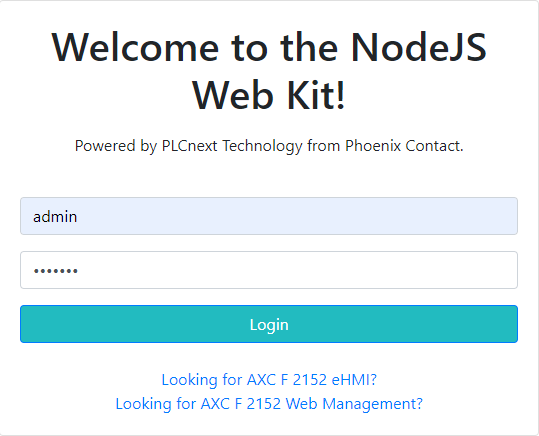
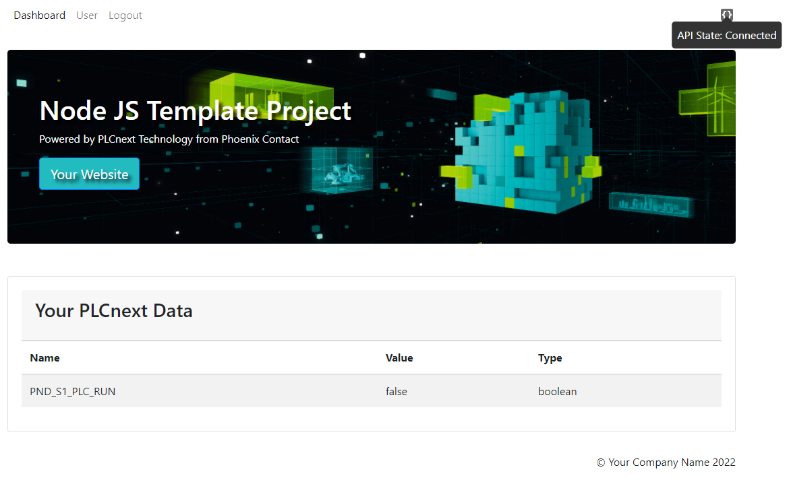

# NodeJS Webkit for PLCnext

This repository serves as an example and a template for creating a full stack NodeJS application on a PLCnext device. The PLCnext web API, which can be used for linking PLCnext data to custom applications, is also supported here. Suggestions on device configuration, data storage, and application scheduling are given throughout.

  
# Getting Started
## **Shell Access**
From a terminal emulator (such as Putty) to an out-the-box PLCnext controller:

    admin@192.168.1.10

The password can be found on the front of the controller.
  
  
## **Root Access**
In /etc/ssh/ @ file sshd_config, uncomment line "PermitRootLogin yes". This will allow ssh as root again. Root will be required for many of the operations below. If this procedure is giving you trouble, just login as admin and su root (assuming you already gave the root user a password via sudo passwd root).
  
  
## **Firmware Version**
To check for the current firmware version of the PLCnext device, in /etc/plcnext:

	cat arpversion

To update the firmware, run the .exe from the latest firmware download to extract the *.raucb file (old FW procedure) or extract the *.raucb from the .zip (new FW procedure). Copy the *.raucb file  to the /opt/plcnext directory. From the /opt/plcnext directory, run the script to start the update:

	sudo update-axcfxx52
  
## **Package Manager** 
Install iPkg (source: http://ipkg.nslu2-linux.org/optware-ng/buildroot-armeabihf/Packages.html):

    wget -O - http://ipkg.nslu2-linux.org/optware-ng/bootstrap/buildroot-armeabihf-bootstrap.sh | sh

Path is not retained after reboot. To add your own profile instructions:

    export PATH=$PATH:/opt/bin:/opt/sbin 
    
For *PLCnext Edge Gateway* products, use the following for Path: 

    source ~/.bash_profile
	
To update your package manager's packages:

    /opt/bin/ipkg update
	/opt/bin/ipkg list

  
## **Node JS**
Install node:

    ipkg install node

Change your NTP server to synchronize your devices clock. Any external token-based connection will not function without complete this step! In /etc @ ntp.conf, add 'server <server name/ip>' (for example, time.google.com). To initiate a synchronization to a remote server:

    date -s "$(curl -s --head http://google.com | grep ^Date: | sed 's/Date: //g')"

Note: It's also possible to synchronize the PLC’s clock to your computers clock using the PLCnext Engineering tool.

Update NPM and Node:

    npm install npm@latest -g
    npm cache clean -f
    npm install -g n
    n stable (or desired version instead of stable, for example: ‘10.16.0’)

Reboot to start the node daemon.

Use *template_project* in this repository as a guide for one way to implement a modern SPA (Single Page Application).

  
# **Additional Packages**
Some helpful packages that may be required for you to accomplish your application goals.

  
## **PM2**
Used for scheduling NodeJS applications. Install PM2:

    npm install pm2 -g

Prepare logging. 

Daemonize application. PM2 will monitor and keep this application alive forever:

	pm2 start <appName>.js

Basic commands to operate PM2 (see https://www.npmjs.com/package/pm2 for a more complete list):

    pm2 list
    pm2 stop
    pm2 restart
    pm2 delete

  
## **Git**
Source repository. Install Git:

    ipkg install git

In /opt:

    git clone <repo url>

In the cloned repo directory, to install all app dependencies (package.json contents):

    npm install

  
## **MySQL**
If your app uses an SQL database (specifically MySQL, although SQLite has also been tested):

    ipkg install mysql

The mySQL daemon will start listening on port 0 unless the following is done before running. In /opt/etc/ @ file my.cnf, comment out "skip-networking".

To start the mysqld daemon:

	(/opt/bin; ./mysqld)

Login:

	mysql -u root -p [enter]
	[enter] (no root password by default)

To import a DB schema, first create a placeholder DB:

    create database <db_name>;

Import the DB export into the placeholder DB:

    mysql -u root -p azure_demo < <db_name>.sql;

  
# **Nginx Web Server Configurations**
Some guidelines for modifying the default Nginx web server configuration for a better user experience.
  

## **nginx.conf**
Node may require a reverse proxy in order to serve a node-based web interface. In /etc/nginx/ @ file nginx.conf, under server, add the location (with your apps port number):

	location / {
		proxy_pass  http://localhost:3010;
		proxy_http_version 1.1;
		proxy_set_header Upgrade $http_upgrade;
		proxy_set_header Connection 'upgrade';
		proxy_set_header Host $host;
		proxy_cache_bypass $http_upgrade;
	}

There will likely already be an existing rule for the ‘/’ location, such as:

    location / {
                    include /etc/plcnext/device/Services/Ehmi 
                    nginx_ehmi_location*.conf;
                    location /favicon. {
                        # ensure no redirect when reading this in 
                        parallel with index.html
                        try_files $uri =404;	
                    }
                    try_files $uri $uri/index.html /redirect;
                    add_header X-Frame-Options SAMEORIGIN;
            }

If that is that case, the old ‘/’ must be replaced with the new one. The user will still be able to access factory web-based management via https://192.168.1.10/wbm.

The result of this configuration will serve your web interface when navigating to the PLC’s IP address in a web browser (as opposed to the factory default). Due to this, it may be considered best practice to put a link to the factory web interface on your landing page in the event that the user requires it.

  
# **Your Application**

## **Running in Development**
Using a tool such as WinSCP, transfer your node application to a directory you create in /opt (requires root access!). Execute the application from the terminal:

    node <application name>
Note: This is a good time to take a look at the included *template_project* for your own Node SPA development needs. 
  
## **Accessing PLCnext Data**
Access to data from PLCnext to your NodeJS application is possible through the PLCnext API. To enable the API, HMI services must first be enabled. Add a global tag to a blank HMI page in a PLCnext project to activate these services (old FW procedure) or enable the services via the controllers local web interface (new FW procedure).

Use *example_project* in this repository as a code-guide to exercising the PLCnext API. If you're using a *PLCnext Edge Gateway* product, the PLCnext API services are already integrated!

Note: *template_project* also implements the PLCnext API, but in a more real-world way. *example_project* should be used to understand the concept first!
  
## **Running in Release**
To schedule a completed application to automatically run when the controller boots, use PM2 as outlined above.